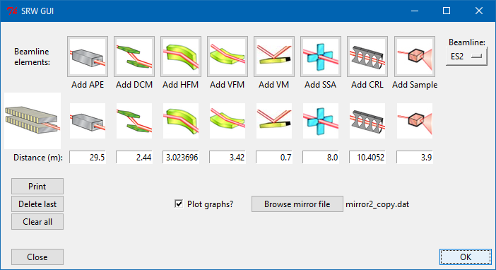
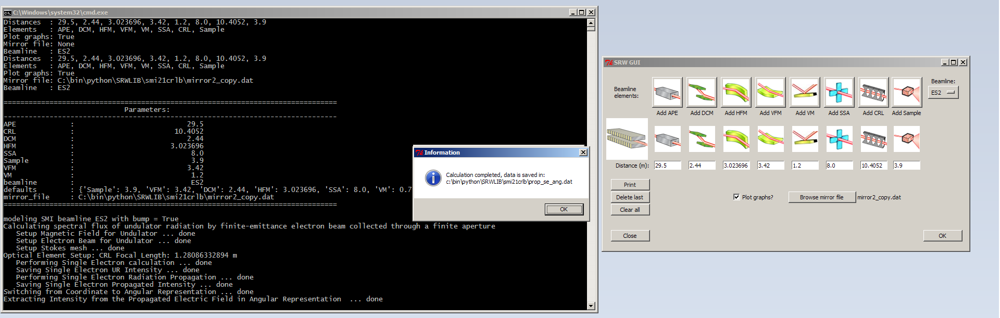
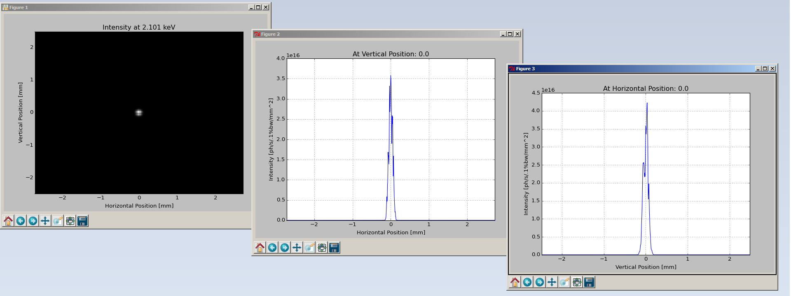

# SRW-gui
Prototype of the TkInter GUI for SRW. Should work out of the box with Python 2.7 (x64). For other Python versions you 
will need to compile SRW and remove the following files:
- [srwlib.py](srwlib.py)
- [srwlpy.pyd](srwlpy.pyd)
- [SRWLIB_ExampleViewDataFile.py](SRWLIB_ExampleViewDataFile.py)
- [uti_plot.py](uti_plot.py)

## Execution workflow:
- Set up an optical scheme:


- Perform the simulation:


- Visualize the results:


Console log:
```
C:\bin\mrakitin\SRW-gui>C:\Python27\python SRWSMI2.1KeV_CRLb.py

================================================================================
                             Parameters:
--------------------------------------------------------------------------------
APE             :                           29.5
CRL             :                        10.4052
DCM             :                           2.44
HFM             :                       3.023696
SSA             :                            8.0
Sample          :                            3.9
VFM             :                           3.42
VM              :                            0.7
beamline        :                            ES2
defaults        : {'Sample': 3.9, 'VFM': 3.42, 'DCM': 2.44, 'HFM': 3.023696, 'SSA': 8.0, 'VM': 0.7, 'CRL': 10.4052, 'APE': 29.5}
mirror_file     : C:\bin\mrakitin\SRW-gui\smi21crlb\mirror2_copy.dat
================================================================================

modeling SMI beamline ES2 with bump = True
Calculating spectral flux of undulator radiation by finite-emittance electron beam collected through a finite aperture
   Setup Magnetic Field for Undulator ... done
   Setup Electron Beam for Undulator ... done
   Setup Stokes mesh ... done
Optical Element Setup: CRL Focal Length: 1.28086332894 m
   Performing Single Electron calculation ... done
   Saving Single Electron UR Intensity ... done
   Performing Single Electron Radiation Propagation ... done
   Saving Single Electron Propagated Intensity ... done
Switching from Coordinate to Angular Representation ... done
Extracting Intensity from the Propagated Electric Field in Angular Representation  ... done
Calculation completed, data is saved in:
C:\bin\mrakitin\SRW-gui\smi21crlb\prop_se_ang.dat

C:\bin\mrakitin\SRW-gui>
```
